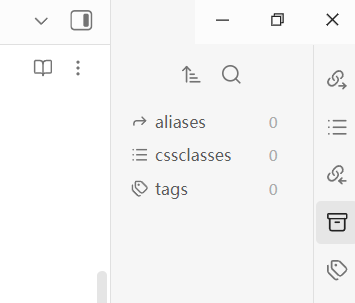

# Right Sidebar Icons

[English](#english) | [中文](#中文)

---

## English

An Obsidian plugin that moves right sidebar icons to a persistent vertical bar and allows reordering via drag-and-drop.

### Features
- **Persistent Vertical Dock**: The right sidebar icons (plugins, core features) are permanently displayed in a clean vertical column, even when the right sidebar panels are collapsed.
- **Drag & Drop Reordering**: Easily rearrange the order of the icons by dragging and dropping them up and down the column.
- **Togglable Mode**: Use the ribbon icon or a hotkey to instantly switch between the default Obsidian view and the custom Right Sidebar Icons mode.
- **State Persistence**: Your custom icon order and sidebar state are automatically saved and restored when you open Obsidian.

### Preview

### Installation

#### Via BRAT
1. Install the **BRAT** plugin from the Obsidian community plugins store.
2. Open BRAT settings: `Community Plugins` > `BRAT` > `Plugins List`.
3. Click `Add Beta plugin`.
4. Copy and paste the repository URL: `https://github.com/Pumatlarge/obsidian-right-sidebar-icons`.
5. Click `Add Plugin`.

#### Manual Installation
1. Go to your Obsidian vault's `.obsidian/plugins/` directory.
2. Create a new folder named `right-sidebar-icons`.
3. Download the `main.js`, `manifest.json`, and `styles.css` files from the latest release.
4. Place those three files inside the new folder.
5. In Obsidian, go to Settings > Community Plugins, disable Safe Mode, and enable "Right Sidebar Icons".

### Usage
- **Reordering**: Click and drag any icon in the vertical column to move it up or down.
- **Toggle Mode**: Click the plugin icon in the left ribbon or use the assigned hotkey (assignable in Settings > Hotkeys) to toggle the vertical column mode.
- **Open Panes**: Click on an icon in the column, and it will expand the right sidebar with its respective pane, just like the default Obsidian behavior.

### Development

To build the plugin from source:

1. Clone this repository.
2. Run `npm install` to install dependencies.
3. Run `npm run dev` to compile the plugin and watch for changes.
4. Run `npm run build` to create a production bundle.

### License
MIT License

---

## 中文

一个 Obsidian 插件，将右侧边栏图标移至持久的垂直栏，并允许通过拖放进行重新排序。

### 功能特性
- **持久垂直停靠栏**：即便在右侧面板折叠时，右侧边栏图标（插件、核心功能）也会以整洁的垂直列持久显示。
- **拖拽排序**：通过在列中上下拖放图标，轻松重新排列图标顺序。
- **模式切换**：通过功能栏图标或快捷键，在默认 Obsidian 视图和自定义“右侧边栏图标”模式之间即时切换。
- **状态持久化**：自定义的图标顺序和侧边栏状态会在打开 Obsidian 时自动保存并恢复。

### 预览

### 安装方法

#### 通过 BRAT 安装
1. 在 Obsidian 社区插件市场中安装 **BRAT** 插件。
2. 打开 BRAT 设置：`第三方插件` > `BRAT` > `Plugins List`。
3. 点击 `Add Beta plugin`。
4. 复制并粘贴本仓库地址：`https://github.com/Pumatlarge/obsidian-right-sidebar-icons`。
5. 点击 `Add Plugin`。

#### 手动安装
1. 进入你的 Obsidian 库的 `.obsidian/plugins/` 目录。
2. 创建一个名为 `right-sidebar-icons` 的新文件夹。
3. 从最新发布版本中下载 `main.js`、`manifest.json` 和 `styles.css` 文件。
4. 将这三个文件放入该文件夹中。
5. 在 Obsidian 中，前往“设置” > “第三方插件”，关闭安全模式，并启用 "Right Sidebar Icons"。

### 使用说明
- **重新排序**：点击并拖动垂直栏中的任何图标即可上下移动。
- **切换模式**：点击左侧功能栏中的插件图标，或使用分配的快捷键（可在“设置” > “快捷键”中设置）来切换垂直栏模式。
- **打开面板**：点击垂直栏中的图标，将像默认行为一样展开对应的右侧边栏面板。

### 开发

若要从源码构建插件：

1. 克隆此仓库。
2. 运行 `npm install` 安装依赖。
3. 运行 `npm run dev` 编译插件并监听更改。
4. 运行 `npm run build` 创建正式版本。

### 许可
MIT License
